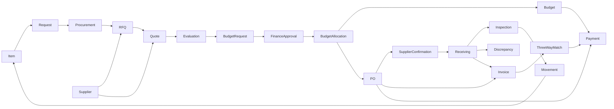
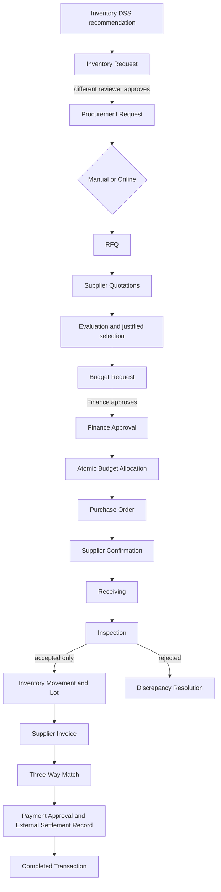
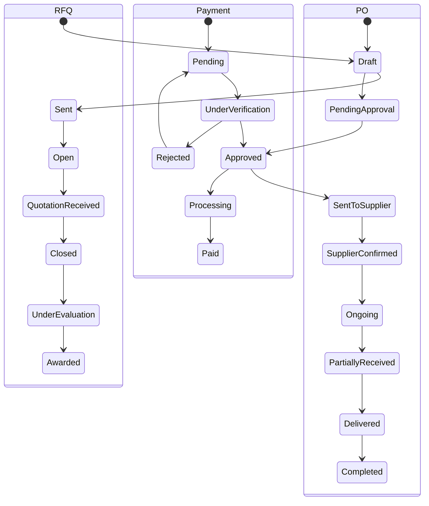
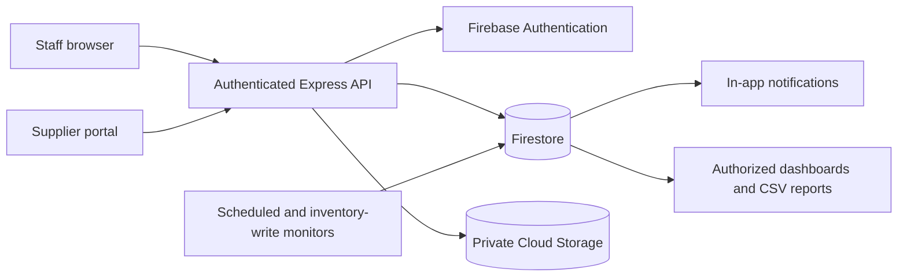

# Integrated supply management implementation

## Architecture and compatibility

Vue department workspaces use authenticated Express `/supply` APIs. Firebase Admin performs all workflow writes in transactions. Existing `inventoryItems`, `inventoryMovements`, `suppliers`, and supplier catalog records remain the shared sources of truth used by bookings and POS. Existing legacy purchase records stay accessible under explicitly labelled legacy screens; they are not silently converted or received again.

New workflow entities live in `supplyRecords` with a required `kind` discriminator. Their IDs are foreign keys within that collection. This keeps branch, visibility, audit, and linking rules consistent without duplicating inventory. All direct client access to new workflow collections is denied by the existing default Firestore rule. The server returns only authorized projections.

## Data schema / entity definitions

Every workflow record has `id`, `kind`, `number`, `branchId`, `status`, `createdBy`, `createdAt`, `updatedAt`, and `links` (IDs of preceding records). Amounts use integer centavos internally. Line items use inventory item IDs; quantities are positive whole units. No floating-point money arithmetic is used for funding or payment.

| Kind | Fields and relationships |
|---|---|
| request | itemId, item snapshot, department, quantity, unit, currentStock, minStock, reason, priority, requiredDate, estimatedCost; becomes linked procurement |
| procurement | requestId, inherited lines/department/reason/date, officer, mode (Manual/Online), method, strategy, documents |
| rfq | procurementId, supplierIds, lines/specifications, deadline, deliveryDate/location, terms, contact; supplier-facing projection |
| quotation | rfqId, supplierId, lines(quantity/unitPrice), discount/tax/delivery/otherCharges, total, validUntil, leadDays, paymentTerms, warranty, notes; edits audited |
| evaluation | procurementId, rfqId, quotationId, supplierId, justification, evaluator; never visible to suppliers |
| budgetRequest | evaluationId, quotationId, procurementId, budgetId, department, category, requested/approved amount, decision/remarks/decider/time |
| budget | department, category, total, committed, spent; available = total - committed - spent |
| financeApproval | budgetRequestId, budgetId, approvedAmount, decision, remarks, financeOfficerId, decidedAt |
| budgetAllocation | budgetRequestId, financeApprovalId, budgetId, amount, spentAmount, releasedAmount, status |
| po | budgetRequestId, budgetId, quotationId, supplierId, lines, total, deliveryDate/location, terms, confirmation, accepted quantities, invoiced quantities, paid amount |
| supplierConfirmation | poId, supplierId, response, reason, confirmedDeliveryDate, respondedBy/respondedAt |
| receiving | poId, supplierId, reference, date, lines(ordered/delivered/accepted/rejected, condition, lot, expiry, serial/model/warranty), inspection, notes, onboarded |
| inspection | receivingId, poId, quantityResult, qualityResult, inspected lines, inspector and timestamp |
| discrepancy | receivingId, poId, supplierId, lines, reason, resolution, responsible user |
| invoice | poId, supplierId, receivingIds, invoiceNumber, invoiceDate/dueDate, lines, charges, total, match result, approvedBy |
| threeWayMatch | invoiceId, poId, receivingIds, status, discrepancy issues, checker and timestamp |
| payment | invoiceId, poId, budgetId, supplierId, amount, method(Manual/External or Electronic), reference, paymentDate, proof document; recorded payment, not money transfer |

`supplyAudit`: recordId, branchId, actor UID/name/role, action, previous/new status, input snapshot, timestamp. Immutable server-written history.

`supplyDocuments`: recordId, branchId, uploader UID, filename, contentType, size, private Storage path, visibility (internal/supplier), intended supplier IDs, createdAt. Downloads require record access; supplier access additionally requires explicit document visibility and ownership.

Inventory fields: existing `name`, `brand`, `description`, `imageUrl`, `category`, `itemType` (Material/Equipment), `consumability`, `unit`, `currentStock`, `reservedStock`, `minStock`, `targetStock`, `maxStock`, `location`, `supplierId`, `createdAt`, `receivedAt`, `expiryDate`, `condition`, `serialNumber`, `modelNumber`, `warranty`, `costPrice`. Receiving updates quantities through linked movement records only. Adjustments have reasons and audit records. Expiration and condition stay available per receipt/lot, not just the current item summary.

## ER diagram

## State machines and approval workflow

- Request: Draft -> Submitted -> Under Review -> Approved / Rejected / Returned. Approval creates Procurement automatically, with a deterministic ID and Sent to Procurement status. Returned requests can be revised and resubmitted. Request creators cannot approve their own requests.
- Procurement: Received -> Under Review -> RFQ Preparation -> RFQ Sent -> Quotations Received -> Evaluation -> For Finance Approval -> Ordered -> Completed/Cancelled.
- RFQ: Draft -> Sent -> Open -> Quotation Received -> Closed -> Under Evaluation -> Awarded/Cancelled. Invited suppliers may quote until the deadline or closure. Procurement records a recommendation and justification; price alone never selects a supplier.
- Budget request: Submitted -> Finance Review -> Approved/Rejected/Returned. Approved funding creates explicit Finance Approval and Budget Allocation records and commits funds atomically. A retry cannot reserve twice.
- PO: Draft -> Pending Approval -> Approved -> Sent to Supplier -> Supplier Confirmed / Rejected / Clarification Requested -> Ongoing -> Partially Received -> Delivered -> Completed. Official issue requires committed funding. Cancellation releases unused commitment.
- Receiving: Inspected -> Onboarded. A separate Inspection record captures quantity and quality results. Accepted + rejected equals delivered; cumulative accepted cannot exceed ordered. Onboarding is idempotent and rejected stock never enters inventory.
- Invoice: Submitted -> Under Verification -> Matched/Disputed -> Approved for Payment -> Paid. A separate Three-Way Match record compares PO, onboarded receiving, prior invoices, prices, and charges. Mismatches block payment.
- Payment: Pending -> Under Verification -> Approved/Rejected -> Processing -> Paid. Preparation, approval by another Finance user, processing, and settlement are separate actions. Settlement records a real external transaction; it never pretends to transfer money.

## Manual and online workflows

Both modes share every internal entity and transition. Manual sourcing requires uploaded RFQ, quotation and PO evidence before progression; staff record supplier confirmation and invoice with supporting documents. Online sourcing exposes RFQs only to addressed suppliers. Suppliers enter their own quotes, confirm their own POs, upload delivery/invoice files, and see their own invoice/payment status. Private evaluation, Finance comments and budgets are never projected to suppliers.

## Roles, scope, separation of duties

All staff requests resolve role/custom-role permissions and branch ownership through the existing user context. Supplier access resolves `suppliers.ownerId` or `supplierUserId`, never a client-provided supplier identity.

| Responsibility | Existing permissions |
|---|---|
| Inventory view/manage/request | inventory:view, inventory:update, inventory:create |
| Inventory approval | inventory:review, different user from requester |
| Procurement read/source/evaluate/PO | procurement:view, procurement:create, procurement:review |
| Logistics inspect/onboard/resolve | orders:view, orders:update |
| Finance view/budgets/verify | finance:payables:view, finance:payables:approve |
| Finance record settlement | finance:payables:settle |
| Branch administration | explicit permissions or administrator:full_access; duty separation still applies |

## API architecture

- `GET /supply/workspace?branchId=`: accessible branches, role capabilities, entity records, item records, suppliers/catalog; supplier-specific projection.
- `POST /supply/items`: validated create/update and explicit opening quantity/adjustment with reason.
- `POST /supply/records`: type-specific creation from linked authorized records, derived totals and inherited snapshots.
- `POST /supply/records/:id/actions`: named state transitions, transactional invariants, audit and notifications.
- `GET /supply/records/:id/history`: authorized timeline and documents.
- `POST /supply/records/:id/documents`: private file upload, metadata validation, bounded file sizes.
- `GET /supply/documents/:id`: authorized short-lived download.
- `POST /supply/reminders`: authorized, idempotent daily low-stock/deadline/delivery notifications; also invoked when the workspace is refreshed.

## Notification, audit, documents, and reporting architecture

Transitions create existing `notifications` records addressed to staff with the next department's permissions, and to relevant supplier accounts. Alert IDs combine record/day/event to avoid repeated reminders. Browser workspaces refresh to update DSS and deadlines; reminders do not place orders. Unattended scheduled execution requires a deployment scheduler to invoke the same service.

Every mutation records an audit entry in the same database transaction. Document metadata is separate from Storage; failed metadata writes clean up the uploaded object. Allowed uploads: PDF, JPEG, PNG, up to 5 MB. No executable files or public buckets. Procurement documents are internal unless explicitly shared with the target supplier.

Department dashboards derive counters and chart series from the same authorized records. Reports provide search, type/status/department/supplier/category/date filters, sorting, pagination and CSV export. Detail views show related records, current owner, responsible department, next action, attachments and history. Finance displays total, committed, available and spent separately. Stock movement and receiving reports retain the IDs needed for backwards tracing.

## Validation plan

Pure model tests cover money, DSS thresholds, quotation arithmetic, invoice matching and transitions. Transactional workflow tests cover both sourcing modes, self-approval rejection, cross-branch and supplier privacy, budget contention/idempotency, repeated/partial/rejected receiving, invoice mismatch, payment retries and budget release. Vue compilation and production build check routes/templates/imports. No live supplier communications, payments, database migration or production deployment are required for local implementation checks.

## Canonical workflow and compatibility routes

`SupplyWorkspace.vue` is the sole Inventory, Procurement, Logistics, and procurement-Finance transaction interface. Older URLs redirect to the matching workspace page so saved bookmarks keep working, but the duplicate components and write endpoints have been removed. Historical `purchaseRequests`, `supplierQuotes`, `purchaseOrders`, `manualPurchases`, and `purchasePayments` records remain read-only for prior reports; all new transactions use `supplyRecords`.

## Deployment architecture

The API is the only workflow writer. Transactions enforce state preconditions, branch ownership, supplier identity, idempotency, budget availability, accepted quantities, invoice matching, and settlement. Suppliers receive a strict projection and explicitly shared documents only.

## Completion design

Background monitoring runs in Firebase Functions: an inventory write trigger updates a daily item snapshot and in-app stock notifications; an hourly scheduled sweep covers expiration changes and RFQ/delivery/invoice deadlines even with no browser open. Notification IDs include recipient, record, event and day. `supplySnapshots/{branch-item-day}` stores branchId, itemId, date, currentStock, minStock, maxStock, flags and timestamp. Snapshot history powers low-stock trends without inventing historical values.

Named report definitions select authorized records and derive financial amounts from payment records, not quotations. Supplier performance compares confirmed delivery dates with actual receiving dates and reports accepted/rejected quantities. Management tracing follows the shared IDs. Report exports include their actual data fields, not a fixed abbreviated subset.

RFQ drafts can be edited before issue; cancellation requires a reason and allows re-sourcing when no funded order exists. Procurement can restart sourcing after an expired/rejected award, retaining old RFQs, quotations and decisions. Inventory draft edits and invoice revisions preserve before/after audit values. Review, approval and payment preparation are named actions, not unrestricted status edits. Read-only dashboards never write purchasing records.

Every staged workflow change receives an audit record (including generated child records and budget movements), and notifications follow each changed record to its responsible department. Private supplier communications have an explicit supplier recipient and cannot be shared with competitors. Document types distinguish invoices from payment evidence.
